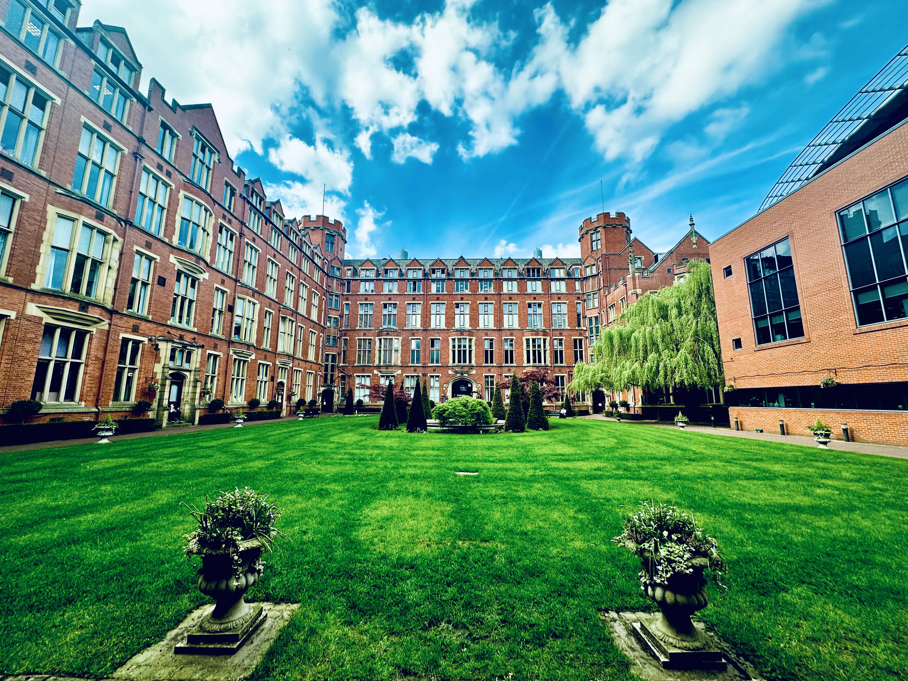

# Biosphere  

Created by a small group of students, Biosphere is the university's first student-led platform that brings together students and ideas from all across the biosciences.   
​
Our aim is to create a supportive community where you can explore academic interests, delevop new ideas, and accesses opportunities to actively engage with industry beyond the classroom.  

  <h4>Meet the committee</h4>
  
  

    
      
        
      
    
  

  
  

    <a href="{{ '/committee/' | relative_url }}" class="btn btn--primary">
      Go <i class="fas fa-arrow-right" aria-hidden="true"></i>
    </a>
  

- (Internships and Employment)[/employability]
- (Study Support)[/study-support]
- (Events)[/events]

